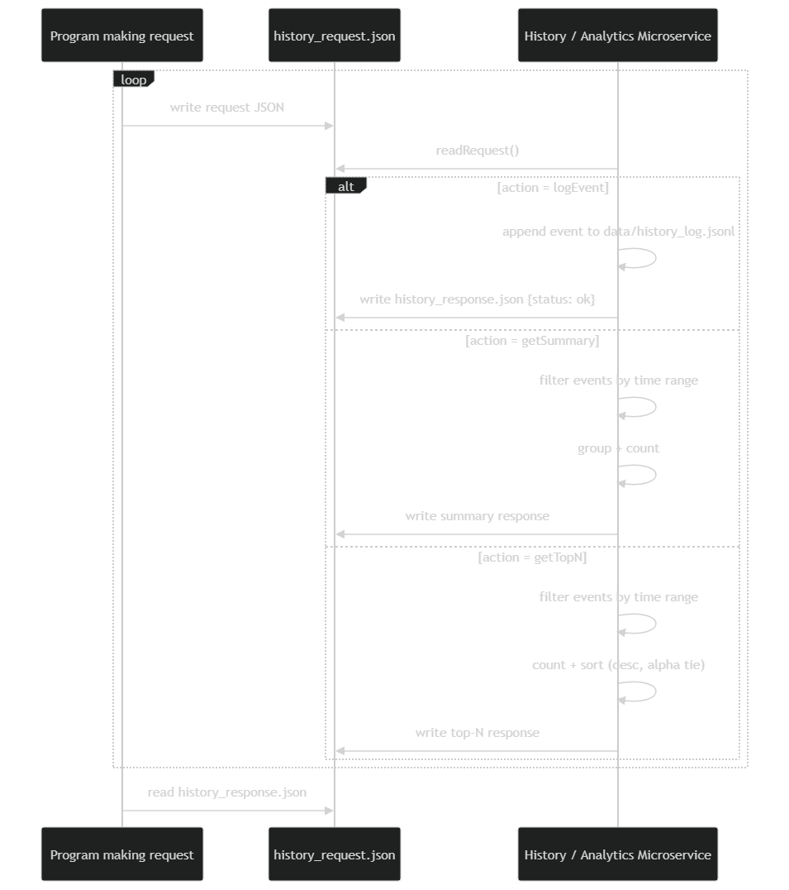

# History / Analytics Tracker Microservice

## Overview

The History / Analytics Tracker microservice records timestamped events to persistent storage and provides analytics over those events.

Supported actions:

1. `logEvent` – Append a timestamped event
2. `getSummary` – Return grouped counts within a time range
3. `getTopN` – Return top-N most frequent values within a time range

This microservice uses **file-based JSON communication**.

---

# Communication Contract

## Request File

The consuming program MUST write a JSON file named: history_request.json

The request must contain an `"action"` field and required parameters.

Once defined, this communication contract will not change, as other microservices depend on it.

---

## Action: logEvent

### Required fields
- `action`: `"logEvent"`
- `timestamp`: ISO-8601 string
- `source`: string
- `eventType`: string

### Optional
- `payload`: JSON object

### Example Request

{
  "action": "logEvent",
  "timestamp": "2026-02-23T00:10:00Z",
  "source": "main_program",
  "eventType": "purchase",
  "payload": {
    "category": "Food",
    "amount": 12.50
  }
}

### Success Response

{ "status": "ok" }

## Action: getSummary

### Required fields
- `action`: `"getSummary"`
- `startTime`: ISO-8601 string
- `endTime`: ISO-8601 string
- `groupBy`: string (example: "eventType" or "payload.category")

### Example Request

{
  "action": "getSummary",
  "startTime": "2026-02-01T00:00:00Z",
  "endTime": "2026-12-31T23:59:59Z",
  "groupBy": "eventType"
}

### Success Response

{
  "status": "ok",
  "range": {
    "startTime": "2026-02-01T00:00:00Z",
    "endTime": "2026-12-31T23:59:59Z"
  },
  "groupBy": "eventType",
  "totals": {
    "purchase": 2
  },
  "count": 2
}

## Action: getTopN

### Required fields
- `action`: `"getTopN"`
- `startTime`: ISO-8601 string
- `endTime`: ISO-8601 string
- `field`: string (example: "payload.category" or "eventType")
- `n`: non-negative integer

### Example Request

{
  "action": "getTopN",
  "startTime": "2026-02-01T00:00:00Z",
  "endTime": "2026-12-31T23:59:59Z",
  "field": "payload.category",
  "n": 3
}

### Success Response

{
  "status": "ok",
  "range": {
    "startTime": "2026-02-01T00:00:00Z",
    "endTime": "2026-12-31T23:59:59Z"
  },
  "field": "payload.category",
  "top": [
    { "value": "Food", "count": 1 },
    { "value": "Games", "count": 1 }
  ]
}

Sorting rules:
- Primary: count descending
- Secondary (tie-breaker): alphabetical order

---

## Error Response

{
  "status": "error",
  "message": "Description of error"
}

Examples:
- Missing required fields
- Invalid ISO timestamp
- Invalid JSON format
- Negative n value

---

## Response File (How to RECEIVE data)

After processing a request, the microservice writes a JSON file named:

`history_response.json`

The consuming program should poll until `history_response.json` exists, then read it as JSON.

Example (pseudocode):
- Delete old `history_response.json` if it exists
- Write `history_request.json`
- Wait until `history_response.json` exists
- Read + parse JSON response

## Persistent Storage

Events are stored (append-only) in:

`data/history_log.jsonl`

Format: JSON Lines (one JSON object per line).

## How to Run

Start the microservice:
`python service/history_service.py`

Run the demo client (in another terminal):
`python test_client/demo_client.py`

## UML Sequence Diagram

